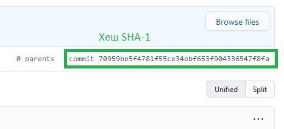

### Команда Git reset  
комманда служит для отмены изменений. Она имеет три основные формы вызова, соответствующие аргументам командной строки `--soft, --mixed, --hard`. Каждый из этих трех аргументов соответствует трем внутренним механизмам управления состоянием Git: дереву коммитов (HEAD), разделу проиндексированных файлов и рабочему каталогу.  
Пример:  
`git reset` - производит отмену изменений с параметрами по умолчанию, а именно как если бы мы выполнили команду `git reset --mixed HEAD` В этом случае HEAD является указанием на конкретный коммит. Вместо HEAD можно использовать любой хеш SHA-1 коммита Git. Посмотреть хеш коммита можно с помощью команды `git log` или на портале [GitHub](https://github.com) в разделе репозитория щелкнув по названию коммита.  
  
`git --hard HEAD` - в отличие от `--mixed` изменит файлы в вашей рабочей директории. Если выполнить то все изменения из более новых коммитов, равно как и незакоммиченные изменения, будут удалены и файлы в репозитории будут совпадать с тем коммитом, который указали (HEAD или хеш нужного коммита)  
`git reset --soft (хеш коммита)` - меняет то на что смотрит флаг HEAD на указанное в команде. 
[к оглавлению](./readme.md)