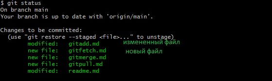

### Команда Git status  
команда выводит информацию обо всех изменениях, внесенных в дерево директорий проекта по сравнению с последним коммитом рабочей ветки; отдельно выводятся внесенные в индекс и неиндексированные файлы.  
Пример:  
`git status`  

[к оглавлению](./readme.md)